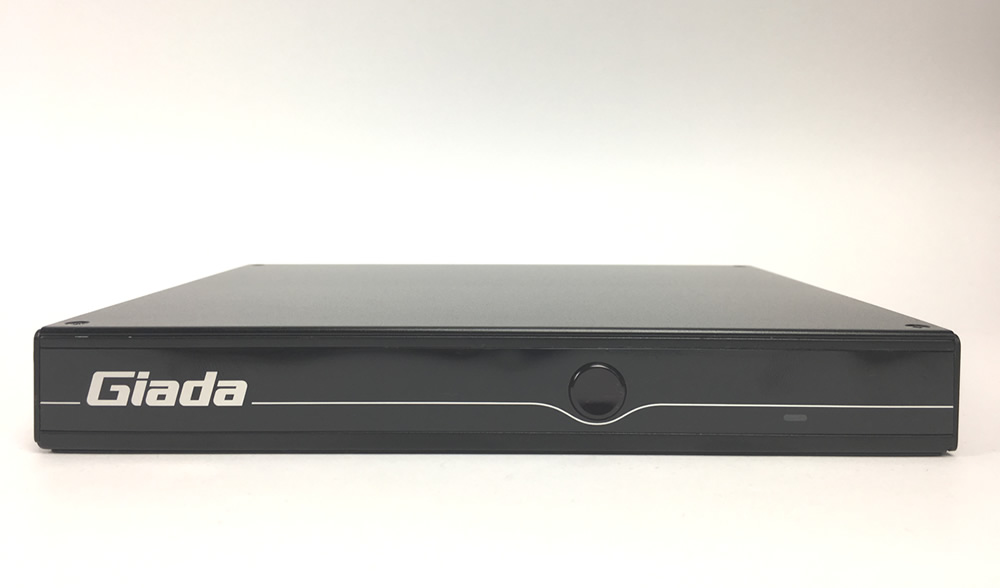
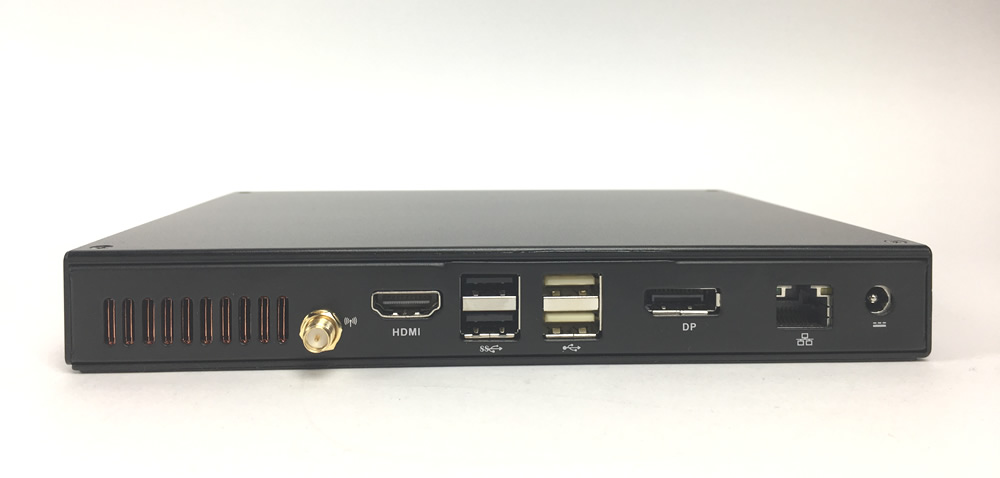
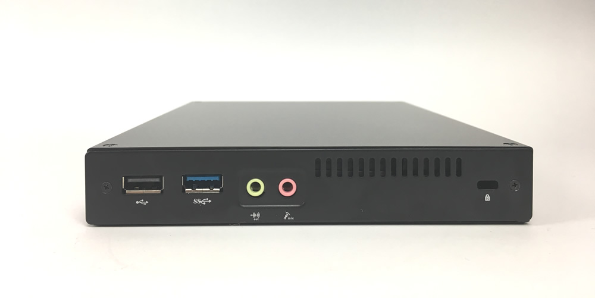
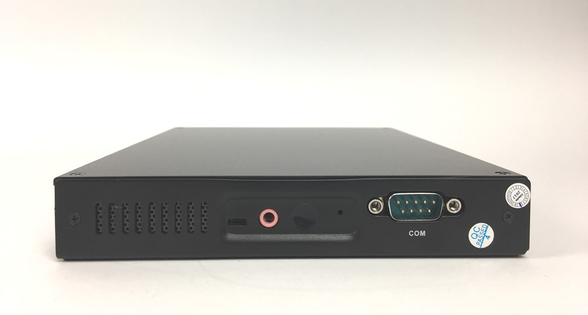
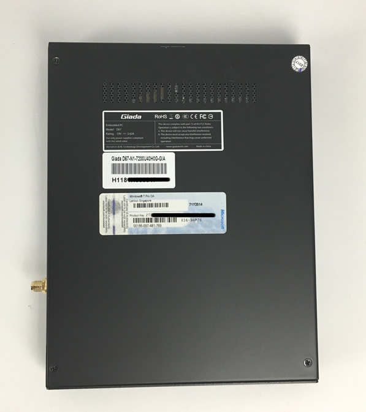

# Giada D67-N1

## Spezifikation

Bereich               | Daten
--------------------- | -----
Abmessungen           | B x H x T: 190 x 149 x 26 mm
Prozessor             | Intel®  Core i5-7200U, 2 Cores / 4 Threads 2.5GHz
Chipset               | SOC
Display               | Intel® HD Graphics 620 DirectX3D 2015, OpenGL5.0, OpenCL 2.1 1 x DP (Max. 4096 x 2160 @60Hz) 1 x HDMI (Max. 1920 x 1080 @60Hz)
Hauptspeicher         | 8GB (DDR4-2133) 
Festplatte            | 120 GB SSD (1 x M.2 for NVMe（PCIe))
Audio                 | 1 x MIC-IN 1 x AUDIO-OUT
Ethernet              | 1x Realtek 8111F Gigabit Ethernet
Wireless              | Exclusive, optionales WiFi / BT / 3G
Schnittstellen vorne  | Ein-/Ausschalter
Schnittstellen linke  | 1 x RS232 COM-Port 1 x MIC-IN 1 x AUDIO-OUT
Schnittstellen rechte | 1 x USB 3.0 1 x USB 2.0 1 x RJ45
Schnittstellen hinten | 1 x HDMI 1 x DP 2 x USB 3.0 2 x USB 2.0 1 x RJ45
Betriebssystem        | Windows® 10 (64-Bit)
Kühlung               | Fanless
Betriebstemperatur    | 0℃ to +40℃ 32℉ to 104℉
Zubehör               | 1 x AC Adaptor 1 x AC Power Cord 4 x runde Gummi-Füße 1 x HDMI-Kabel

## Weitere Bilder

