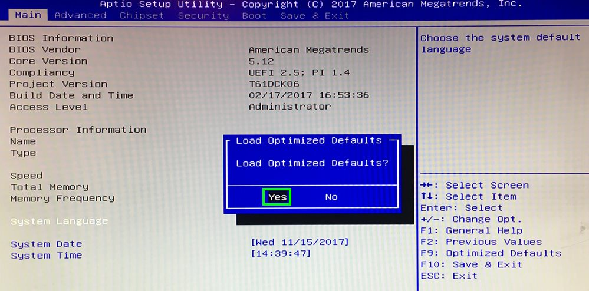
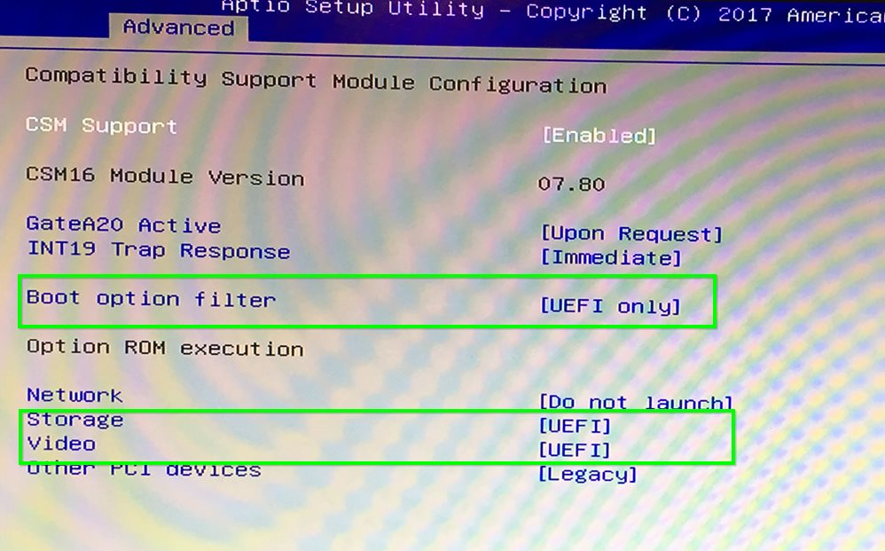
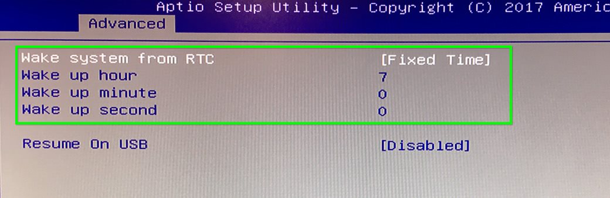

# Giada D67-N1 | BIOS konfigurieren

> #### info::Modell
> Giada D67-N1 (120GB HD)

* Beim Rechner-Start drücken Sie die Taste `[Entf]`.

* Drücken Sie `[F9]`, anschließend die `[Eingabetaste]`, um die Einstellungen neu zu setzen.

Unter der Registerkarte `Chipset` wählen Sie `South Cluster Configuration`, anschließend `Miscellaneous Configuration`. Unter **State After G3** wählen Sie `S0 State` aus.

Unter der Registerkarte `Advanced` wählen Sie `CSM Configuration`. Unter **Boot option filter** wählen Sie `UEFI only` aus. Unter **Storage** wählen Sie `UEFI` aus.

* Drücken Sie `[F10]`, anschließend die `[Eingabetaste]`, um die Einstellungen abzuspeichern und den Rechner neu zu starten.

# Wake-On-LAN (WOL)

Wenn Wake-On-LAN (WOL) gewünscht ist, muss diese Funktion nur in [Windows](/tips/wake-on-lan/README.md) freigeschaltet werden. Dieser Rechner reagiert auf Wake-On-LAN-Anfragen, trotz fehlender Einstellung im BIOS.

# Einschalten durch Real Time Clock

Unter dieser Option kann man eine Uhrzeit einstellen, zu der das System täglich hochgefahren wird.

Diese Option befindet sich unter der Registerkarte `[Advanced]` und `[Wake system from RTC]`.

