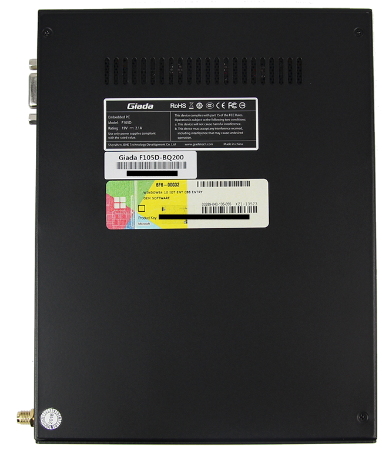

# Giada F105D

## Spezifikation

Bereich               | Daten
--------------------- | -----
Abmessungen           | B x H x T: 190 x 149 x 26 mm
Prozessor             | Intel® Celeron® Prozessor N3450, 4 Cores / 4 Threads 2GHz, Burst Frequency 1.1 GHz
Chipset               | Integriert
Display               | Intel® HD Graphics 500 Microsoft® DirectX® 11.1 1 x VGA Port (Max. 1920 x 1200@ 60Hz) 1 x DP1.2 1 x DP (Max. 4096 x 2160@ 60Hz) 1 x HDMI 1.4b (Max. 4096 x 2160@ 24Hz)
Hauptspeicher         | 4GB (1x DDR3L-1600MHz) 
Festplatte            | mSATA 128GB SSD
Audio                 | Realtek ALC662-VD0 1 x MIC-IN,1 x AUDIO OUT
Ethernet              | 2x Realtek 8111F, Gigabit Ethernet
Wireless              | Exclusive, optionales IEEE 802.11 b/g/n WLAN-Modul
IR                    | Onboard IR module An infrared sensor (Vorderseite) Remote Control (Optional)
Erweiterungen         | 2 x Mini-PCI Express® ( Full-length for mSATAⅡ SSD; Half-length for PCIE/USB)
Anschlüsse            | 1 x USB3.0 1 x USB2.0(Rechte Seite) 2 x USB3.0 2 x USB2.0 (Vorderseite) 1 x DP1.2, 1 x HDMI1.4b, 1 x VGA 1 x COM Port (Linke Seite) 1 x DC-IN jack (19V)
Betriebssystem        | Windows® 10 (64-Bit)
Kühlung               | Fanless
Betriebstemperatur    | 0℃ to +40℃ 32℉ to 104℉
Zubehör               | 1 x AC Adaptor 1 x AC Power Cord 4 x runde Gummi-Füße 1 x HDMI-Kabel

## Weitere Bilder

