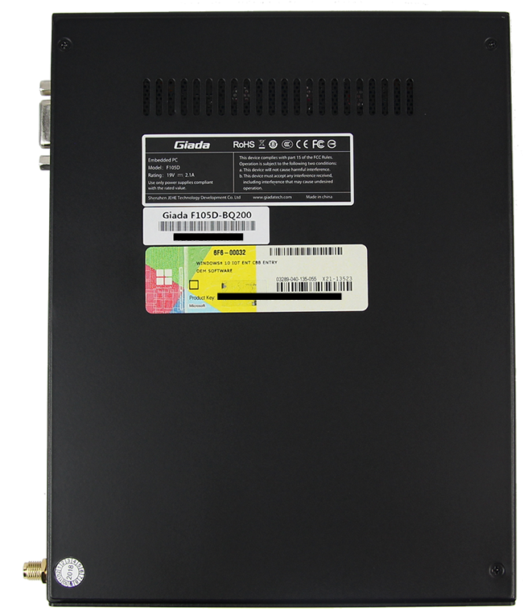
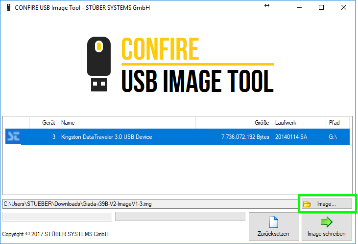
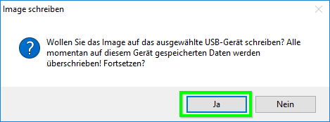
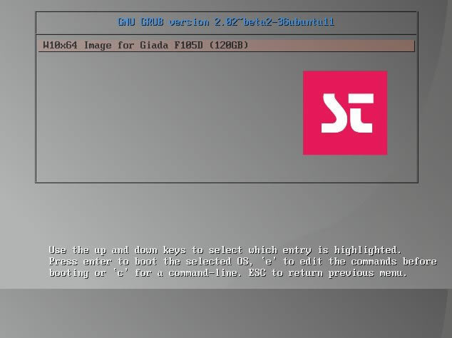
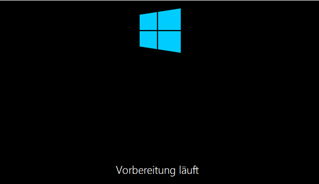
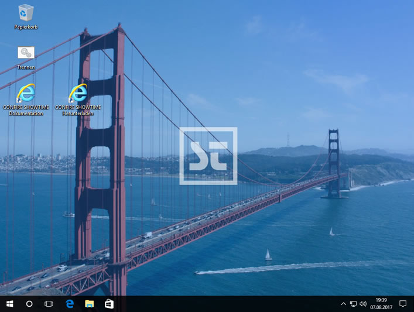

# Windows 10 \(64 Bit\) Image installieren: IOT-Lizenz (ENT 2016 LTSB)

> #### info::Modell
>
> Giada F105D \(120GB HD\). Dieses Windows 10 Image muss mit der Windows Lizenz `Windows 10 IOT ENT 2016 LTSB Entry` aktiviert werden. Um zu ermitteln welche Windows 10 Lizenz Sie haben, schauen Sie auf der Rückseite des Rechners.

Wenn Ihre Windows-Lizenz [Windows 7 Pro](W10x64_win7upgrade.license.md) (Upgrade-Lizenz) oder [Windows 10 IOT ENT CBB ENTRY](W10x64_win10-IOT-ENT-CBB-Entry-Licence.md) lautet, wählen Sie die entsprechende Anleitung für diese Lizenz.

## 1. USB-Stick vorbereiten

> #### primary::Hinweis
>
> Um dieses Image auf dem Rechner installieren zu können, ist ein USB-Stick mit mindestens 8 GB Speicherplatz nötig.

* Zunächst laden Sie bitte die [Image-Datei](ftp://ftp.stueber.de/pub/bin/de/windowsembedded/usb-images/Giada-F105D-LTSB-ImageV1-8.img
  ) und das [CONFIRE USB Image Tool](ftp://ftp.stueber.de/pub/bin/de/windowsembedded/usb-images/CONFIRE-USBImageTool.exe) herunter.

* Stecken Sie den USB-Stick ein.

* Öffnen Sie `CONFIRE USB Image Tool` per Doppelklick. Wenn die folgende Benutzerkontensteuerung erscheint, müssen Sie mit `Ja` bestätigen.

Das Programm öffnet sich. Wählen Sie Ihren USB-Stick aus, suchen Sie die Image-Datei **Giada-F105D-LTSB-ImageV1-8.img** per die Schaltfläche `Image` aus, anschließend wählen Sie `Image schreiben`.

* Um fortzufahren, wählen Sie einfach `Ja`. 

## 2. Image installieren

* Stecken Sie den USB-Stick, den Sie im Schritt eins vorbereitet haben, in einen USB-Port.

* Um das Bootmenü zu erreichen, schalten Sie den Rechner ein und halten Sie die Taste `[F12]` gedrückt.

* Im Bootmenü wählen Sie die Option für den USB-Stick `UEFI: .......... Partition 1` aus.

Es erscheint das folgende Menü:

* Drücken Sie `[Eingabetaste]`, um fortzufahren.

Nach etwa 10 Minuten gelangen Sie zum Desktop. 

* Den USB-Stick können Sie jetzt entfernen.

* Unter `START` -> `Einstellungen` können Sie Ihren `Windows Product Key` eingeben. Dieser [befindet](README.md#weitere-bilder) sich an der rechten Seite des Rechners.

* Ein Download-Link befindet sich auf dem Desktop, um CONFIRE SHOWTIME herunterzuladen und installieren.

* Geben Sie zum Schluss Ihre Lizenzierungsdaten für den Confire SHOWTIME Player ein, die Sie per E-Mail erhalten haben. Wenn Sie diese Daten nicht mehr finden, melden Sie sich bei uns.

