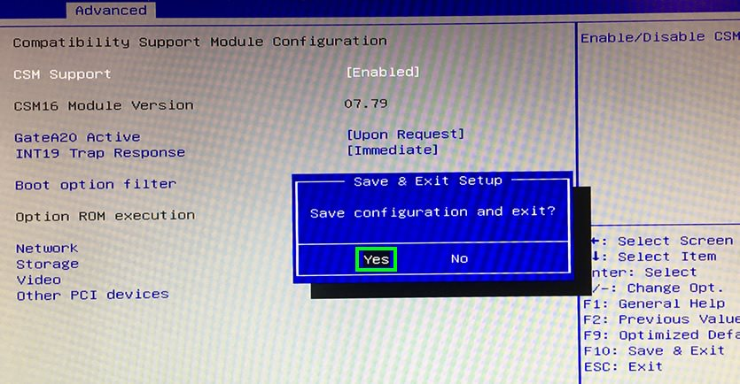

# Giada F105D | BIOS konfigurieren

> #### info::Modell
> Giada F105D (120GB HD)

* Beim Rechner-Start drücken Sie die Taste `[Entf]`.

* Drücken Sie `[F9]`, anschließend die `[Eingabetaste]`, um die Einstellungen neu zu setzen.

Unter der Registerkarte `Chipset` wählen Sie `South Cluster Configuration`, anschließend `Miscellaneous Configuration`. Unter **State After G3** wählen Sie `S0 State` aus.

Unter der Registerkarte `Advanced` wählen Sie `CSM Configuration`. Unter **Boot option filter** wählen Sie `UEFI only` aus. Unter **Storage** wählen Sie `UEFI` aus.

* Drücken Sie `[F10]`, anschließend die `[Eingabetaste]`, um die Einstellungen abzuspeichern und den Rechner neu zu starten.

# Wake-On-LAN (WOL)

## WoL im BIOS freischalten

Wenn Wake-On-LAN (WOL) gewünscht ist, finden Sie die Einstellung dazu unter der Registerkarte `Advanced` -> `Wake Configuration`.

* Unter "Wake On Lan" wählen Sie die Option `[Enabled]` aus.

* Drücken Sie `[F10]`, anschließend die `[Eingabetaste]`, um die Einstellungen abzuspeichern und den Rechner neu zu starten.

## WoL in Windows freischalten

* Unter Windows in den Einstellungen des LAN-Adapters aktivieren Sie die Eigenschaft `Wake-On-LAN herunterfahren`:

Weitere Informationen zu Wake-On-LAN (WOL) finden Sie [hier](/tips/wake-on-lan/README.md)

# Wake system from RTC

Unter dieser Option kann man eine Uhrzeit einstellen, zu der das System täglich hochgefahren wird.

Diese Option befindet sich unter der Registerkarte `[Advanced]` und `[Wake system from RTC]`.

