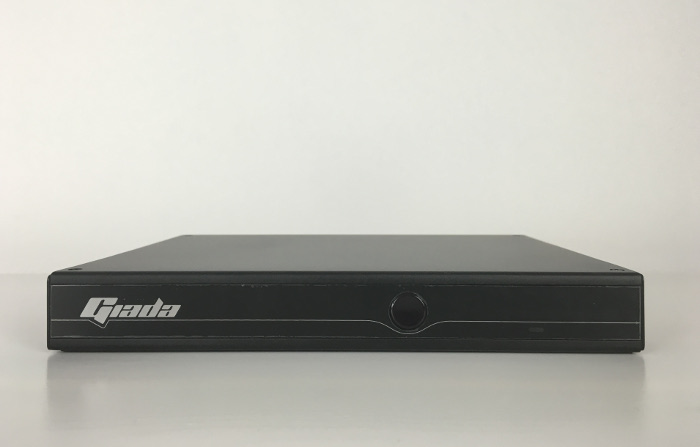
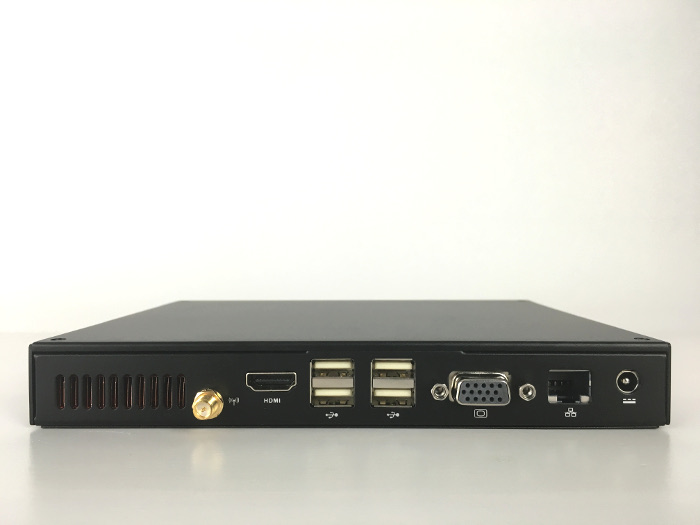
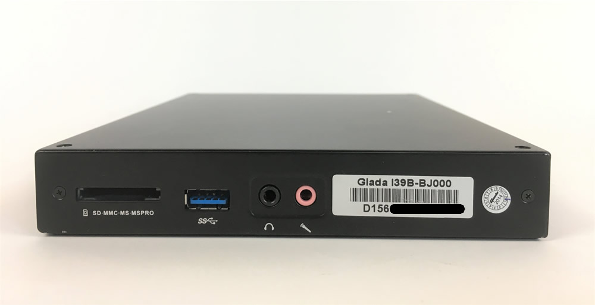
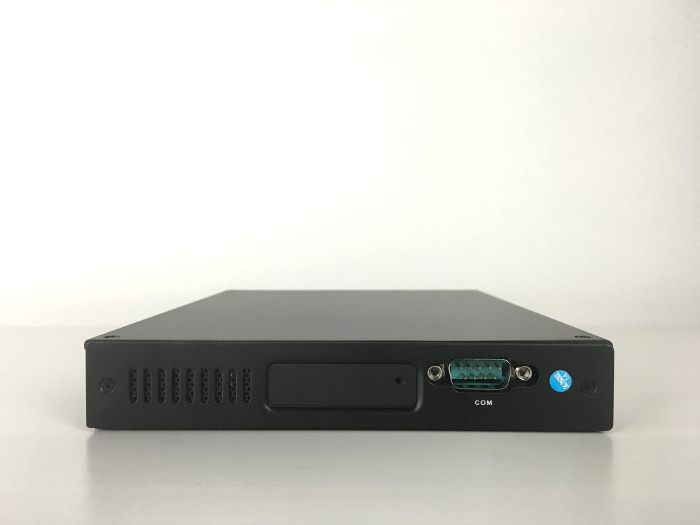
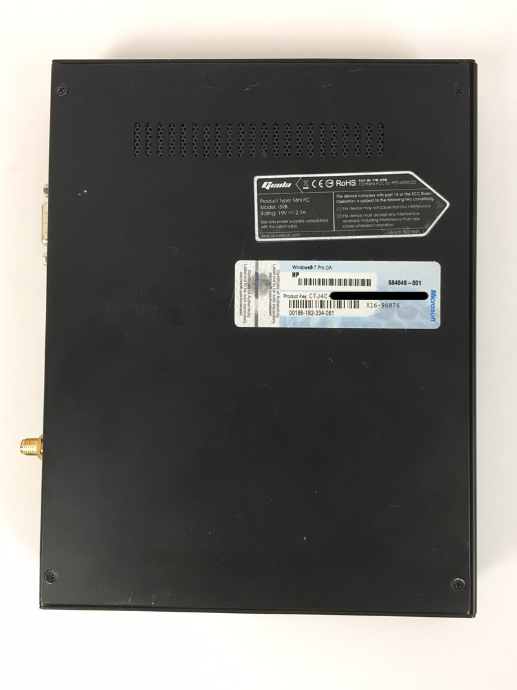

# Giada i39B V1

## Spezifikation

Bereich               | Daten
--------------------- | -----
Abmessungen           | B x H x T: 191 x 34.5 x 195 mm
Prozessor             | Intel® Celeron® Prozessor J1900, 4 Cores / 4 Threads 2GHz, Burst Frequency 2.41GHz, TDP 10W
Chipset               | Integriert in CPU
Display               | Intel® HD Graphics Microsoft® DirectX® 11 1x VGA Port 1x HDMI 1.4a mit Audio-Unterstützung
Hauptspeicher         | 4GB (1x SO-DIMM DDR3L-1333MHz) 
Festplatte            | 60 GB SSD 2,5"
Audio                 | Realtek® High Definition Audio (5.1) Digital Audio per HDMI-Anschluss, 1x Audio-OUT & S/PDIF combo jack 1x Mic-IN Jack
Ethernet              | 1x Realtek® Gigabit Ethernet Controller, RJ45-Anschluss (Rückseite)
Wireless              | Exclusive, optionales IEEE 802.11 b/g/n WLAN-Modul
IR                    | Onboard IR module An infrared sensor (Vorderseite) Remote Control (Optional)
Erweiterungen         | 2x Mini-PCI Express® ( Full-length for mSATAⅡ SSD; Half-length for PCIE/USB)
Anschlüsse            | 1x USB3.0 (Rechte Seite) 4x USB2.0 (Vorderseite) 1x COM Port (Linke Seite) 1x 4-in-1 Card Reader (SD/MMC/MS/MS PRO) (Rechte Seite) 1x DC-IN jack (19V)
Betriebssystem        | Windows® 7, 8, 8.1, 10, & Linux®
BIOS                  | AMI EFI BIOS; ACPI
Kühlung               | Smart Fan
Betriebstemperatur    | 0℃ to +40℃ 32℉ to 104℉
Zubehör               | 1x Driver CD 1x AC Adaptor 1x AC Power Cord 4x runde Gummi-Füße 1x HDMI-Kabel

## Weitere Bilder {#Bilder-Giada-i39B-V1}

