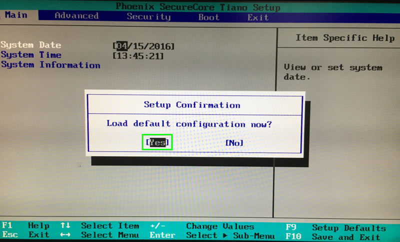
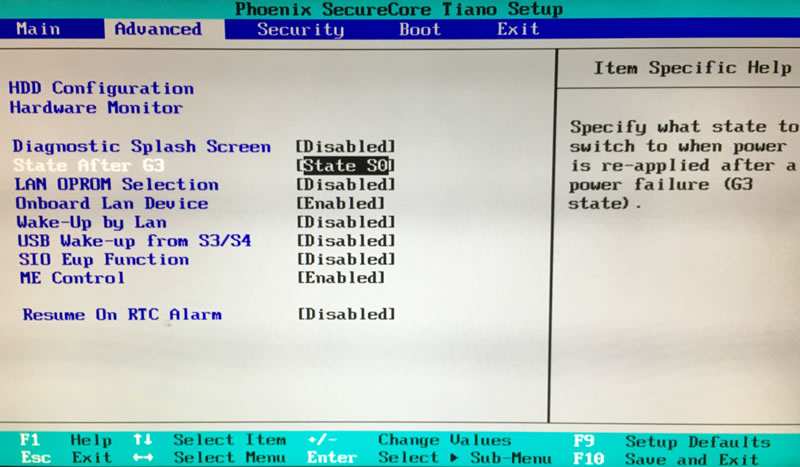
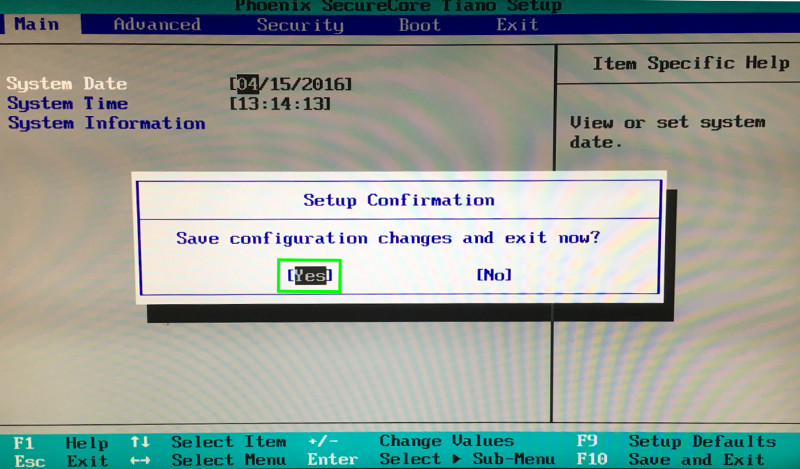
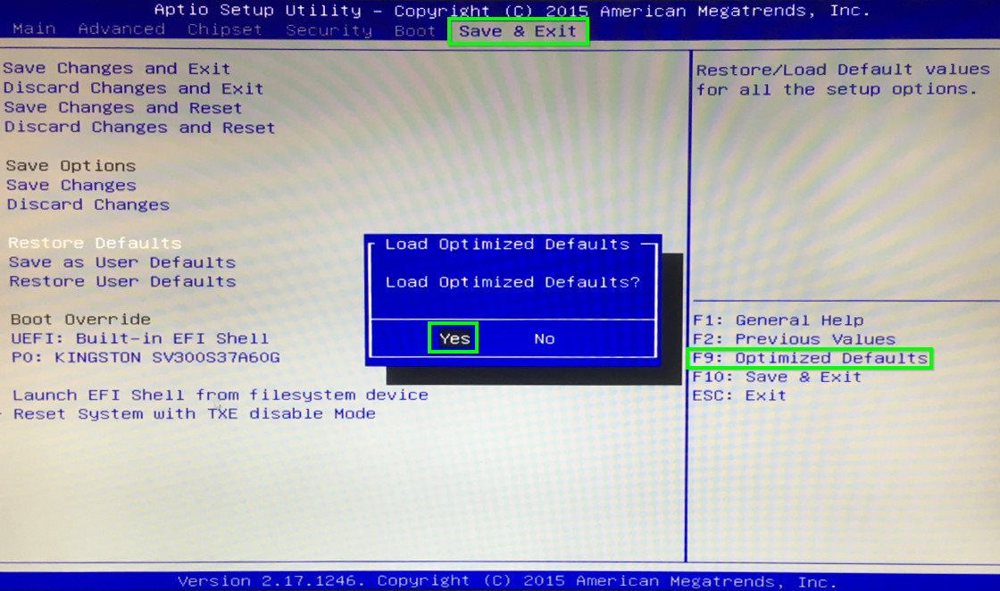
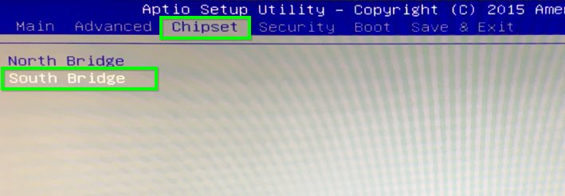
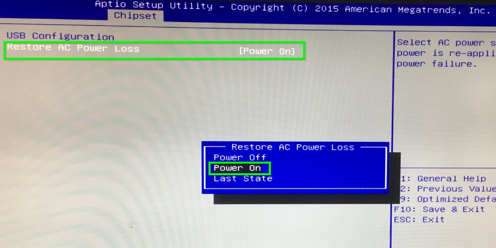
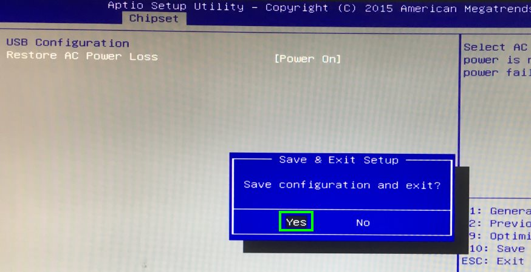
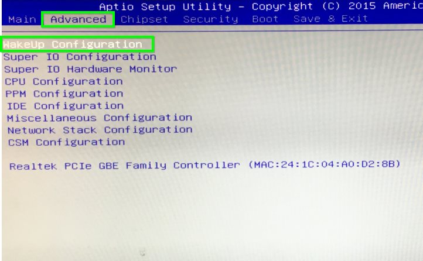
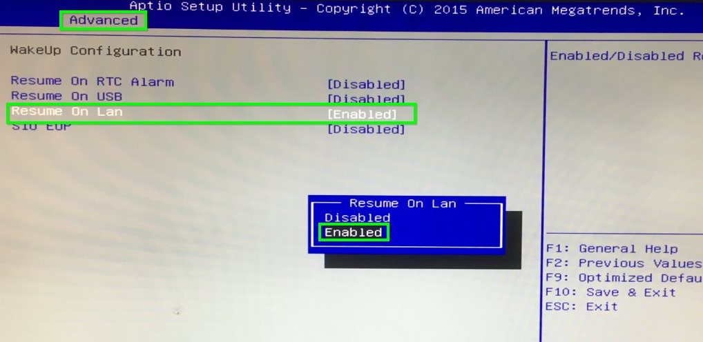
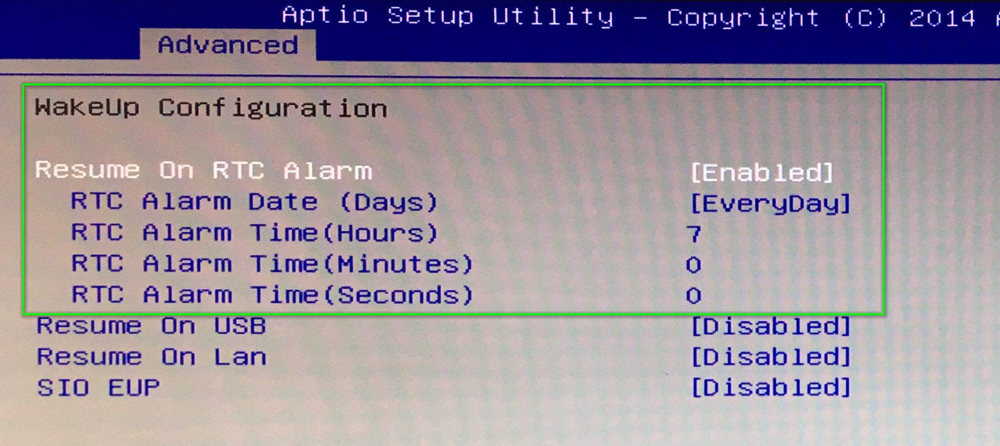

# Giada i39B V1 | BIOS konfigurieren

> #### info::Modell
> Giada i39B V1 (60GB HD)

Wählen Sie die passende Anleitung für Ihren Giada i39B Rechner:

## BIOS-Art: Phoenix SecureCore Tiano

* Beim Rechner-Start drücken Sie die Taste `[F2]`.

* Drücken Sie `[F9]`, anschließend die `[Eingabetaste]`, um die Einstellungen neu zu setzen.

* Mit den Pfeiltasten wählen Sie die Registerkarte `[Advanced]`, anschließend unter `[State After G3]` wählen Sie `[State S0]` aus.

* Drücken Sie `[F10]`, anschließend die `[Eingabetaste]`, um die Einstellungen abzuspeichern und den Rechner neu zu starten.

## Wake-On-LAN (WOL)

Wenn Wake-On-LAN (WOL) gewünscht ist, finden Sie die Einstellung dazu unter der Registerkarte "Advanced".

")

## BIOS-Art: American Megatrends Inc

* Beim Rechner-Start drücken Sie die Taste `[Entf]`.

* Drücken Sie `[F9]`, anschließend die `[Eingabetaste]`, um die Einstellungen neu zu setzen.

* Mit den Pfeiltasten wählen Sie die Registerkarte `[Chipset]` und wählen Sie die Option `[South Bridge]` aus.

* Unter "Restore AC Power Loss" wählen Sie die Option `[Power On]` aus.

* Drücken Sie `[F10]`, anschließend die `[Eingabetaste]`, um die Einstellungen abzuspeichern und den Rechner neu zu starten.

## Wake-On-LAN (WOL)

Wenn Wake-On-LAN (WOL) gewünscht ist, finden Sie die Einstellung dazu unter der Registerkarte "Advanced".

* Unter "Resume On LAN" wählen Sie die Option `[Resume On LAN]` aus.

* Drücken Sie `[F10]`, anschließend die `[Eingabetaste]`, um die Einstellungen abzuspeichern und den Rechner neu zu starten.

## Einschalten durch Real Time Clock

Unter dieser Option kann man eine Uhrzeit einstellen, zu der das System täglich hochgefahren wird.

Diese Option befindet sich unter der Registerkarte `[Advanced]` und `[Resume on RTC Alarm]` stellen Sie die gewünschte Uhrzeit ein.

