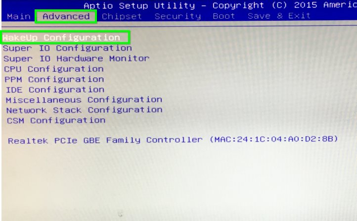

# Giada i39B V2 | BIOS konfigurieren

> #### info::Modell
> Giada i39B V2 (60GB HD)

* Beim Rechner-Start drücken Sie die Taste `[Entf]`.

* Drücken Sie `[F9]`, anschließend die `[Eingabetaste]`, um die Einstellungen neu zu setzen.

* Um das gewünschte Betriebssystem (z.B. Windows 10) unterstützen zu können, müssen Sie unter `Advanced` -> `Miscellaneous Configuration` mit den Pfeiltasten die passende Auswahl (d.h. Windows 8.X für Win8.X bis Win10) treffen. Bestätigen Sie mit der Eingabe-Taste.

* Unter `OS Selection` wählen Sie z.B. `Windows 8.X` aus.

* Wählen Sie die Registerkarte `[Chipset]`, anschließend die Option `[South Bridge]` aus.

* Unter "Restore AC Power Loss" wählen Sie die Option `[Power On]` aus.

* Drücken Sie `[F10]`, anschließend die `[Eingabetaste]`, um die Einstellungen abzuspeichern und den Rechner neu zu starten.

## Wake-On-LAN (WOL)

Wenn Wake-On-LAN (WOL) gewünscht ist, finden Sie die Einstellung dazu unter der Registerkarte "Advanced".

* Unter "Resume On LAN" wählen Sie die Option `[Resume On LAN]` aus.

* Drücken Sie `[F10]`, anschließend die `[Eingabetaste]`, um die Einstellungen abzuspeichern und den Rechner neu zu starten.

## Einschalten durch Real Time Clock

Unter dieser Option kann man eine Uhrzeit einstellen, zu der das System täglich hochgefahren wird.

Diese Option befindet sich unter der Registerkarte `[Advanced]` und `[Resume on RTC Alarm]` stellen Sie die gewünschte Uhrzeit ein.

