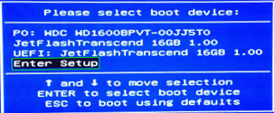
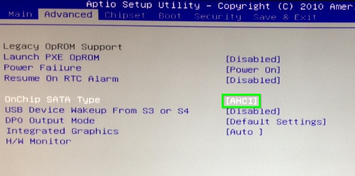

# Nano E450 | BIOS konfigurieren

> #### info::Modell
> Nano E450 (320GB HD)

* Beim Rechner-Start drücken Sie die Taste `[F12]`.

* Mit den Pfeiltasten wählen Sie `[Enter Setup]` aus.

* Mit den Pfeiltasten wählen Sie die Registerkarte `[Save & Exit]`, dann `[Restore Defaults]`, anschließend wählen Sie `[YES]`, um die Einstellungen erst neu zu setzen.

* Wählen Sie die Registerkarte `[Advanced]`. Under 'OnChip SATA Type' wählen Sie `[AHCI]`.

* Jetzt drücken Sie `[F10]` und wählen Sie `[YES]`, um die Änderungen abzuspeichern und den Rechner neu zu starten.**

## Wake-On-LAN (WOL)

Wenn Wake-On-LAN (WOL) gewünscht ist, muss diese Funktion nur in [Windows](/tips/wake-on-lan/README.md) freigeschaltet werden. Dieser Rechner reagiert auf Wake-On-LAN-Anfragen, trotz fehlender Einstellung im BIOS.

