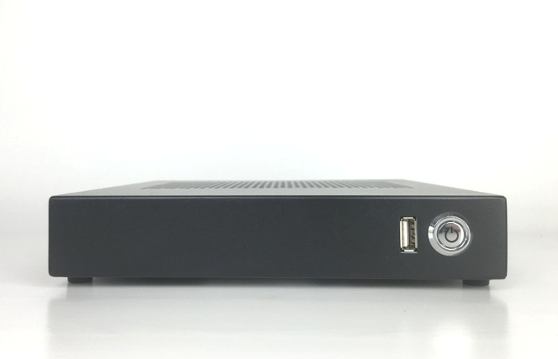
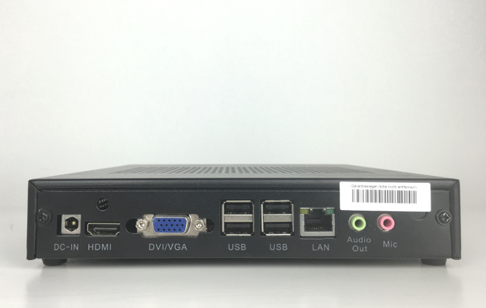

# Nano T56N

## Spezifikation

Bereich               | Daten
--------------------- | -----
Abmessungen           | B x H x T: 191 x 34.5 x 195 mm
Prozessor             | AMD G-T56N, 2 Cores / 2 Threads 1.65GHz, TDP 18W
Chipsatz              | Integriert in CPU
Display               | AMD Radeon HD 6320 Graphics Microsoft® DirectX® 11 1x VGA-Anschluss 1x HDMI mit Audio-Unterstützung 
Hauptspeicher         | 2GB/4GB (1x/2x 2048 MB SO-DDRIII)
Festplatte            | 320 GB SATA 2,5" HDD
Audio                 | Realtek® High Definition Audio (5.1). Digital Audio per HDMI-Anschluss, 1x Audio out & 1x Mic-IN Jack
Ethernet              | 1x Realtek® Gigabit Ethernet Controller, RJ45-Anschluss (Rückseite)
Wireless              | Exclusive, optionales IEEE 802.11 b/g/n WLAN-Modul
IR                    | Exclusive
Anschlüsse            | 1x USB2.0 (Vorderseite) 4x USB2.0 (Rückseite) 1x DC-IN 3,42 A (19V)
Betriebssystem        | Windows® 7 32/64-Bit
BIOS                  | AMI BIOS
Umgebung              | 0° C - 40 ° C at 0%-90% rel. hum.
Kühlung               | Aktive Kühlung / Smart Fan Solution
Zubehör               | 1x Netzgerät 1x Netzkabel 4x runde Gummi-Füße 1x HDMI-Kabel inkl. VESA Halterung (100 x 100 mm)

## Weitere Bilder

