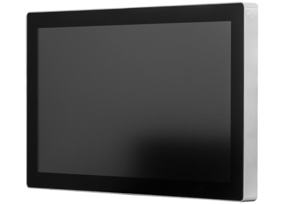

# Posline 46

## Spezifikation

Bereich               | Daten
--------------------- | -----
Modelnummer           | DS-91-489
Abmessungen           | B x H x T: 1078 x 633 x 110 mm
Artikelgewicht        | 25.2 kg
Prozessor             | AMD G-T56N, 2 Cores / 2 Threads 1.65GHz, TDP 18W
Chipsatz              | Integriert in CPU
Display               | AMD Radeon HD 6320 Graphics Microsoft® DirectX® 11 1x VGA-Anschluss 1x HDMI mit Audio-Unterstützung 
Hauptspeicher         | 4GB PC3-8500 (DDR3)
Festplatte            | 120 SSD
Audio                 | Realtek® High Definition Audio (5.1). Digital Audio per HDMI-Anschluss, 1x Audio out & S/PDIF combo jack 1x Mic-IN Jack
Ethernet              | 1x Realtek® Gigabit Ethernet Controller, RJ45-Anschluss (Rückseite)
Wireless              | Exclusive, optionales IEEE 802.11 b/g/n WLAN-Modul
IR                    | Exclusive
Anschlüsse            | 1 x LAN, 4 x USB 2.0, 1 x HDMI, 1 x Audio
Betriebssystem        | Windows® 7 64-Bit
Energieverbrauch      | 115W
Kühlung               | Passive Cooling
Zubehör               | 1x Treiber-DVD 1x Netzkabel 1x RGB-Kabel
