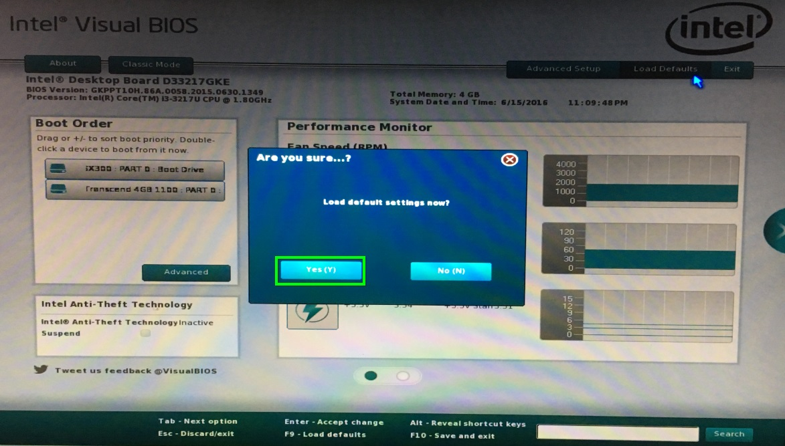
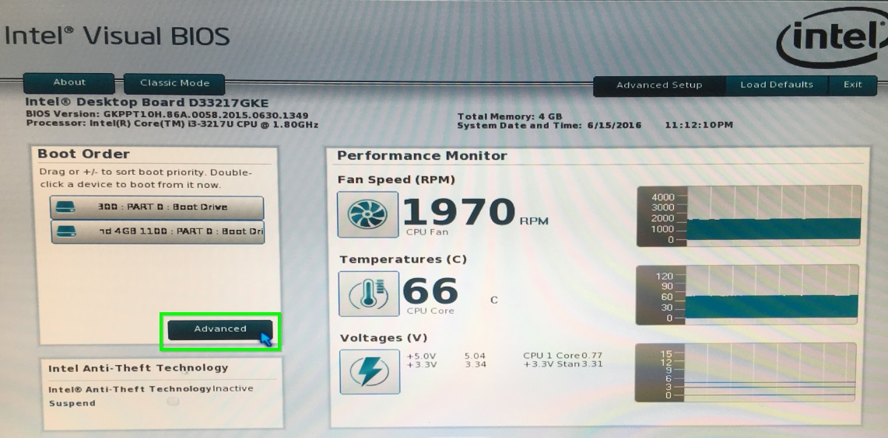
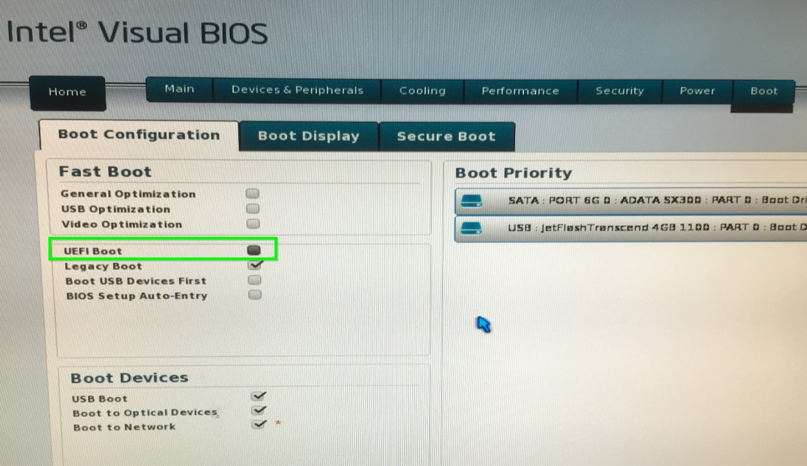
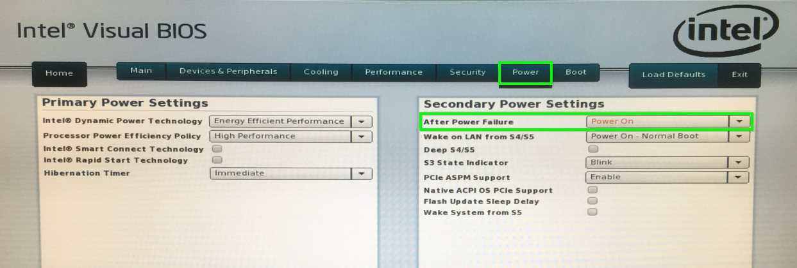

# Step DS500 | BIOS Konfigurieren

> #### info::Modell
> Step DS500 (60GB HD)

* Beim Rechner-Start drücken Sie die Taste `[F2]`.

* Drücken Sie die Taste `[F9]` und mit der Maus und wählen Sie `[YES]`, um die Einstellungen erst neu zu setzen.

* Mit der Maus wählen Sie im linken Panel unter "Boot Order" die Schaltfläche `[Advanced]`.

* Unter der Registerkarte "Boot Configuration" entfernen Sie das Häkchen bei `[UEFI Boot]`

* Wählen Sie die Registerkarte "Power" und im rechten Panel unter "After Power Failure" wählen Sie `[Power On]` aus.

* Um die Änderungen abzuspeichern, drücken Sie die Taste `[F10]`, anschließend wählen Sie `[YES]`.

