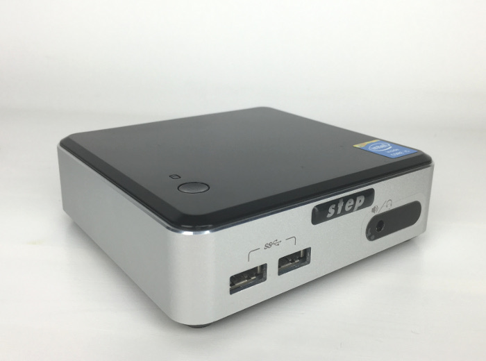
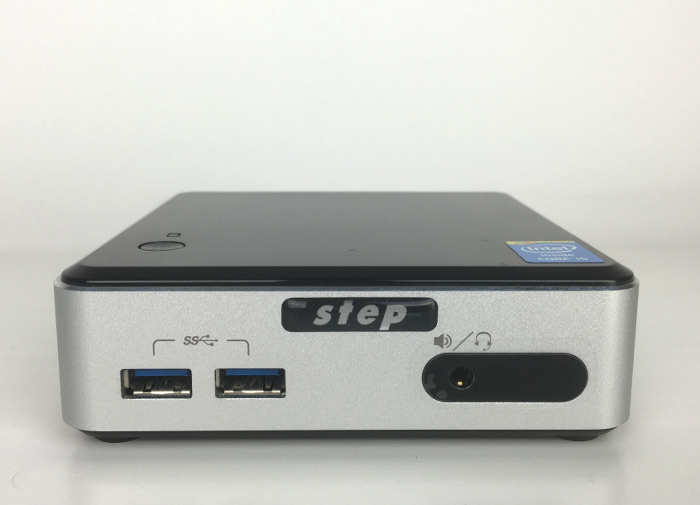
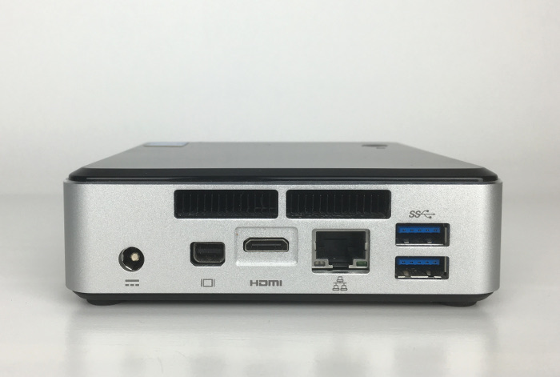
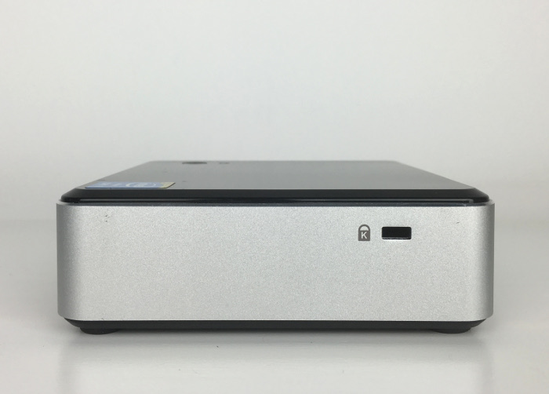

# Step DS503

## Spezifikation

Bereich               | Daten
--------------------- | -----
Abmessungen           | B x H x T: 117 x 39 x 112 mm
Prozessor             | Intel Core i5-4250U 3M Cache, 2 Cores / 4 Threads 2.6GHz, TDP 15W
Chipsatz              | Mobile Intel® QS77 Express Chipset (Intel® BD82QS77 PCH)
Display               | HD Graphics 5000 Microsoft® DirectX® 11 1x Mini DisplayPort 1.2 mit Audio-Unterstützung 1x Mini-HDMI-Port 1.4a mit Audio-Unterstützung
Hauptspeicher         | 4GB (DDR3-SDRAM)
Festplatte            | 120 GB mSATA SSD
Audio                 | Intel® High-Definition-Audio (Intel® HD-Audio) mit folgender Konfiguration: 8-Kanal-Digitalaudio (7.1) über HDMI-1.4a-Ausgang und einen DisplayPort-1.2-Anschluss Kopfhörer/Mikron-Buchse aus der Vorderseite
Ethernet              | Integrierte Intel® PRO 10/100/1000-Mbit/s-Netzwerkschnittstelle (Rückseite)
Wireless              | Exklusiv, optionales IEEE 802.11 b/g/n WLAN-Modul
IR                    | Infrarotempfänger (Vorderseite)
Erweiterungen         | Ein Mini-PCI-Express-Steckplatz mit voller Länge (mSATA-Unterstützung) Ein Mini-PCI-Express-Steckplatz mit halber Länge
Anschlüsse            | 2x USB3.0 (Vorderseite) 2x USB3.0 (Rückseite) 2x USB2.0-Ports über interne Anschlussleiste 1x DC-IN 3,42 A (19V)
Betriebssystem        | Windows® 7 64-Bit
BIOS                  | Intel Visual BIOS-ID-String: WYLPT10H.86A
Umgebung              | 0° C - 40 ° C at 0%-90% rel. hum.
Kühlung               | Kühler mit Lüfter
Zubehör               | 1x Netzgerät 1x Netzkabel 4x runde Gummi-Füße 1x HDMI-Kabel inkl. VESA Halterung (75 x 75 und 100 x 100 mm)

## Weitere Bilder

