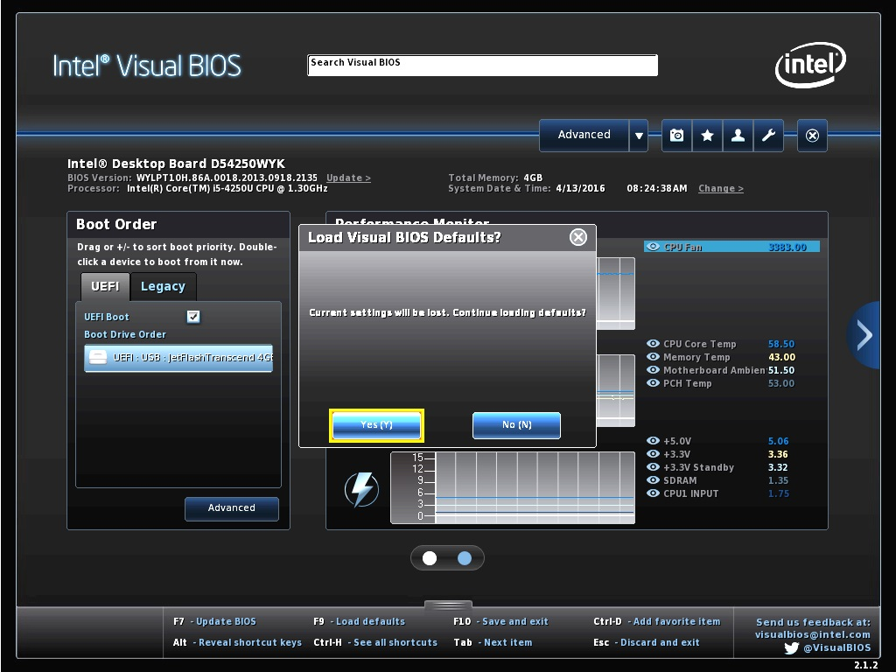
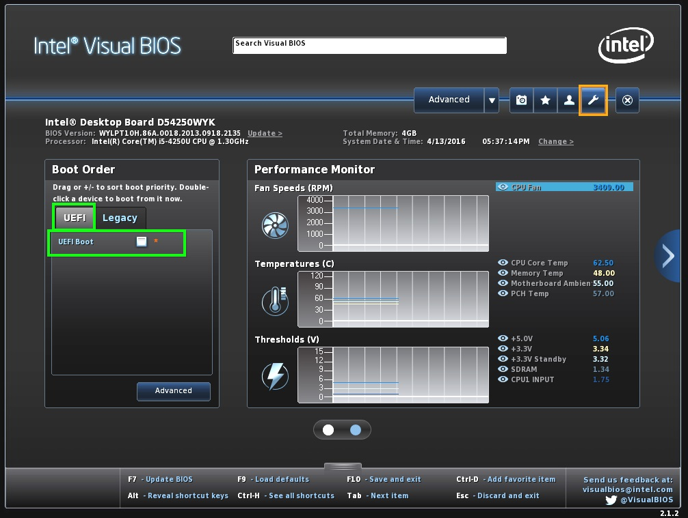
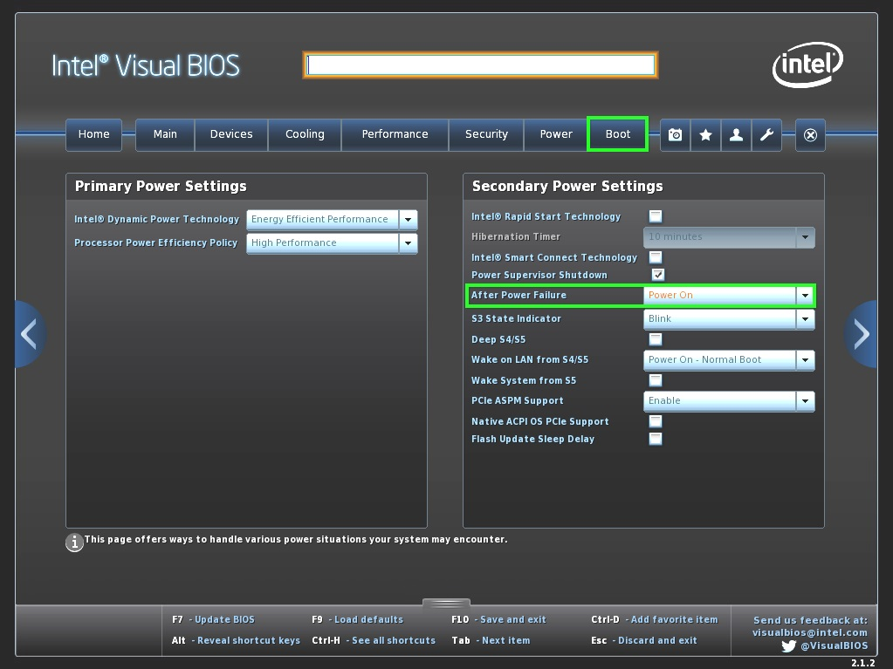
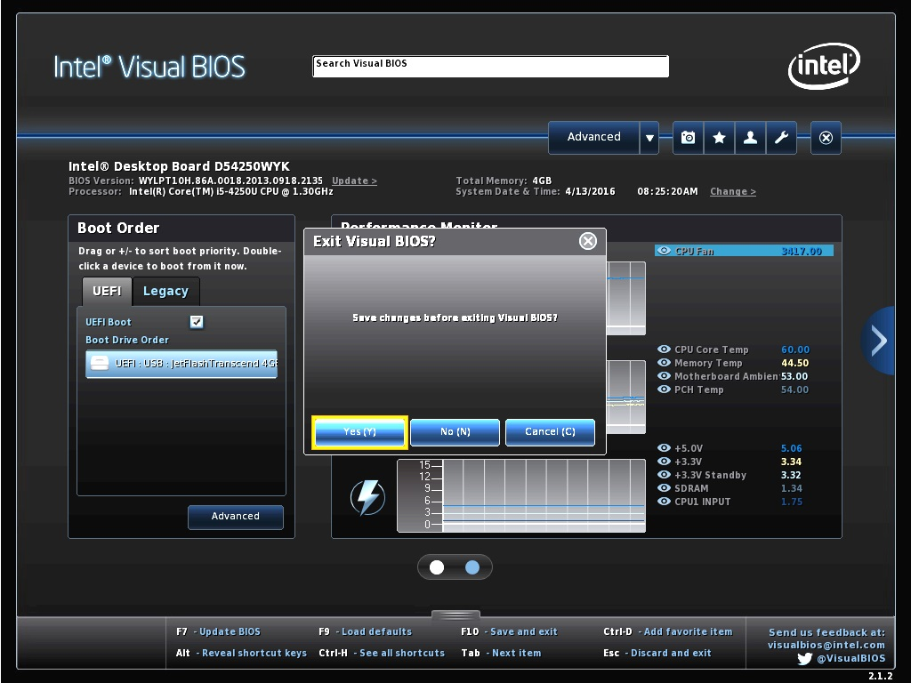

# Step DS503 | BIOS Konfigurieren

> #### info::Modell
> Step DS503 (120GB HD)

* Beim Rechner-Start drücken Sie die Taste `[F2]`.

* Drucken Sie die Taste `[F10]`, anschließend wählen Sie [YES], um die Einstellungen erst neu zu setzen. 

* Entfernen Sie das Häkchen in dem UEFI Boot-Kästchen.

* Wählen die Schaltfläche "Advanced", anschließend "Boot". Unter "After Power Failure" wählen Sie "Power On" aus.

* Um die Änderungen abzuspeichern, drucken Sie die Taste `[F12]`. Drücken Sie die Taste `[Eingabe]`, um "Yes" zu bestätigen.

## Wake-On-LAN (WOL)

Wenn Wake-On-LAN (WOL) gewünscht ist, müssen Sie nichts weiteres Vornehmen. Beim Neusetzen der BIOS-Einstellungen dieses Rechners, wird Wake-On-LAN automatisch freigeschaltet. Zur Info die Einstellung dazu "Wake on LAN from S4/S5" befindet sich under der Registerkarte **Boot**.
