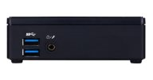
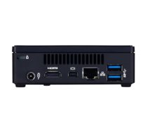

# Step DS513

## Spezifikation

Bereich               | Daten
--------------------- | -----
Abmessungen           | B x H x T: 114.4 x 33.9 x 107.6 mm
Prozessor             | Intel Core i3-3217U 3M Cache, 2 Cores / 4 Threads 2.1 GHz, TDP 17W
Chipsatz              | Mobile Intel® QS77 Express Chipset (Intel® BD82QS77 PCH)
Display               | HD Graphics 5500 Microsoft® DirectX® 11 1x HDMI-1.4a mini DisplayPort maximale Auflösung über DisplayPort: 3840 x 2160 Pixel @ 60 Hz
Hauptspeicher         | 4GB (DDR3L RAM)
Festplatte            | 120 GB mSATA SSD
Audio                 | Acht-Kanal-Audio-Subsystem (7.1) über zwei HDMI-1.4a-Ausgänge
Ethernet              | Integrierte Intel® PRO 10/100/1000-Mbit/s-Netzwerkschnittstelle (Rückseite)
Wireless              | Exklusiv, optionales IEEE 802.11 b/g/n WLAN-Modul
IR                    | Exklusiv
Erweiterungen         | PCI-Express-Erweiterungssteckplatz für Mini-Karte im Standardformat ("Fullsize") und mSATA-Unterstützung PCI-Express-Erweiterungssteckplatz für Mini-Karte in halber Länge
Anschlüsse            | 2x USB3.0 (Vorderseite) 2x USB3.0 (Rückseite) 1x DC-IN 3,42 A (19V)
Betriebssystem        | Windows® 7 64-Bit
BIOS                  | Intel BIOS-ID-String: GKPPT10H.86A
Umgebung              | 0° C - 40 ° C at 0%-90% rel. hum.
Kühlung               | Kühler mit Lüfter
Zubehör               | 1x Netzgerät 1x Netzkabel 4x runde Gummi-Füße 1x HDMI-Kabel inkl. VESA Halterung (75 x 75 und 100 x 100 mm)

## Weitere Bilder

