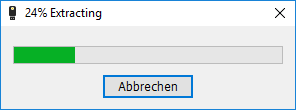
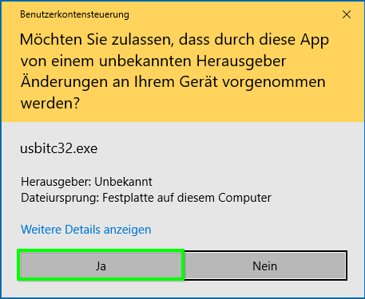
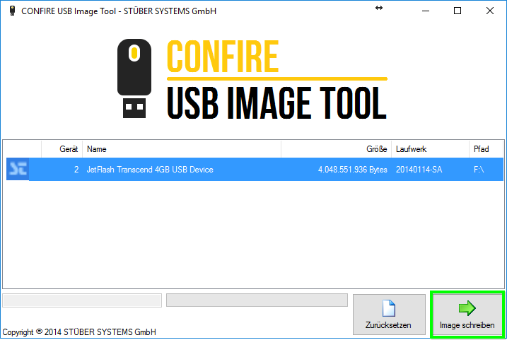
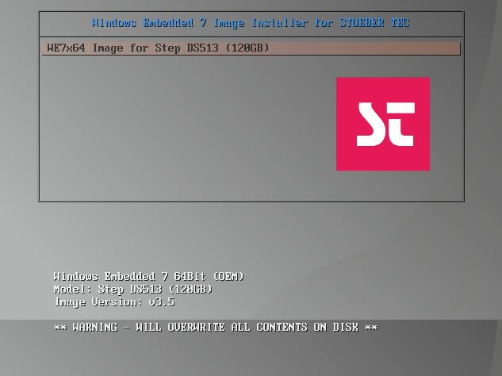
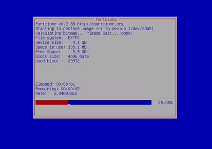
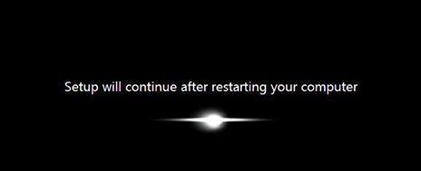

# Windows Embedded 7 (64 Bit) Image installieren

> #### info::Modell
> Step DS513 (120GB HD)

## 1. Schritt: USB-Stick vorbereiten

> #### primary::Hinweis
> Um das Image auf dem Rechner installieren zu können, benötigt man einen bootfähigen USB-Stick mit einem Image drauf.

* Zunächst laden Sie bitte die Image-Datei unter [folgendem Link] herunter.

* Stecken Sie den USB-Stick ein (mindestens 4 GB).

* Öffnen Sie die Datei `WE7x64_Step-DS513.exe` per Doppelklick. Das Programm extrahiert einige temporären Dateien auf den lokalen Datenträger. Dies kann einige Minuten dauern.

* Wenn die folgende Benutzerkontensteuerung erscheint, müssen Sie mit `Ja` bestätigen.

* Das folgende Programm erscheint. Wählen Sie Ihren USB-Stick aus, anschließend wählen Sie `Image schreiben`.

* Zum Bestätigen wählen Sie einfach `OK`. 

## 2. Schritt: Image installieren

* Stecken Sie den USB-Stick, den Sie im Schritt eins vorbereitet haben, in einen USB-Port.

* Um das Bootmenü zu erreichen, schalten Sie den Rechner ein und halten Sie die Taste F10 gedrückt (F12 bei manchen Rechnern).

* Im Bootmenü wählen Sie den USB-Stick aus.

> #### primary::Wichtig
> Wählen Sie nicht die Option mit „UEFI“ am Anfang.

Es erscheint das folgende Menü:

* Drücken Sie `[Eingabetaste]`, dann `ja`, anschließend `[Eingabetaste]`, um fortzufahren.

Nach etwa 20 Minuten gelangen Sie zum Windows-Desktop.

* Den USB-Stick können Sie jetzt entfernen.

Geben Sie nun als letzten Schritt Ihre Lizenzierungsdaten für den Confire Blackboard Player ein, die Sie per E-Mail erhalten haben. Wenn Sie diese Daten nicht mehr finden, melden Sie sich bei uns.

[folgendem Link]: https://download.stueber.de/bin/de/windowsembedded/usb-images/WE7x64_Step-DS513.exe
