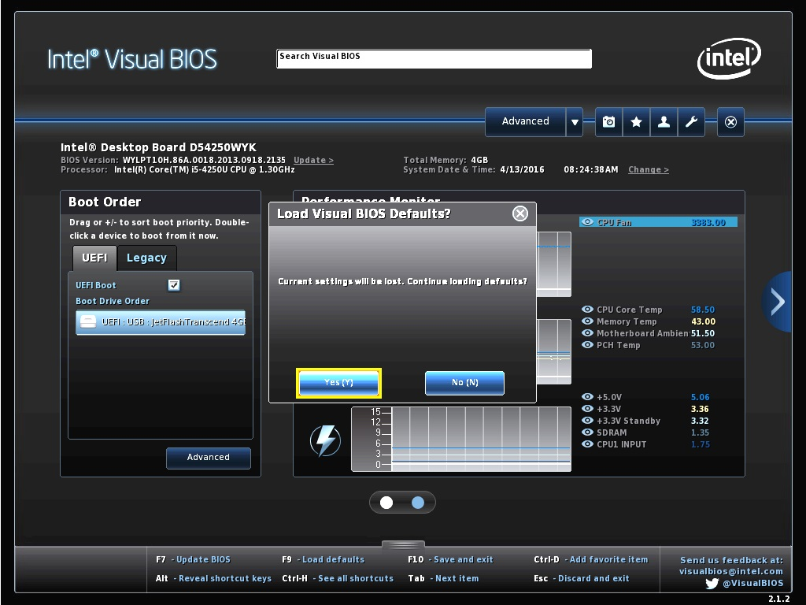
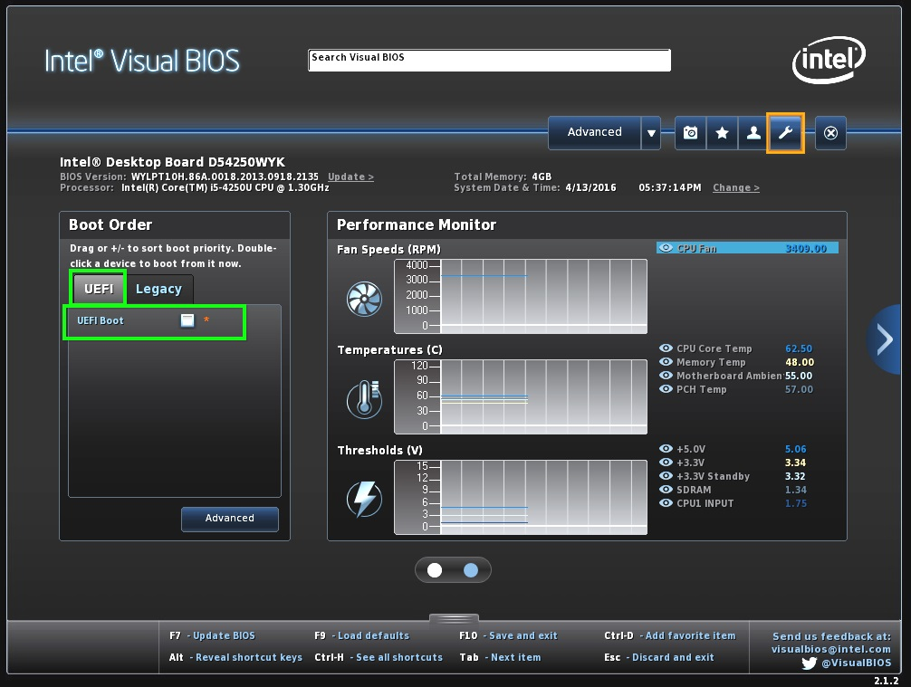
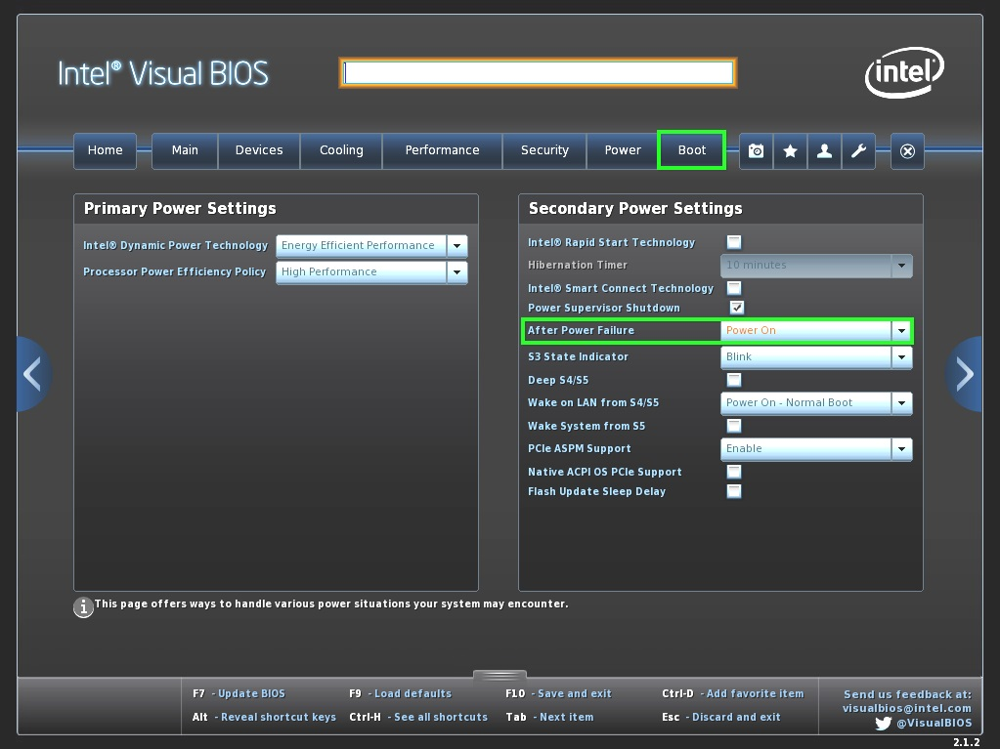
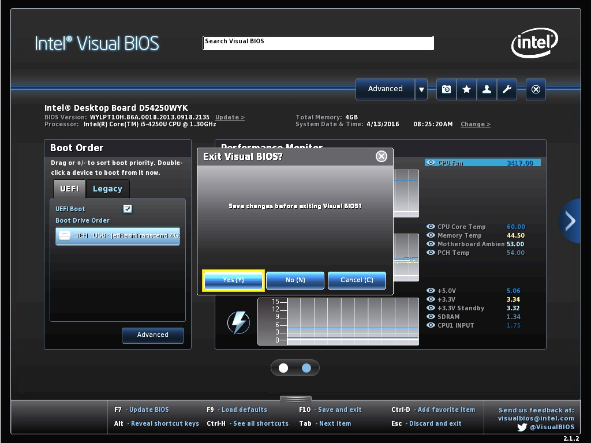

# Step DS513 | BIOS Konfigurieren

> #### info::Modell
> Step DS513 (120GB HD)

* Beim Rechner-Start drücken Sie die Taste `[F2]`.

* Drucken Sie die Taste `[F10]`. Um "Yes" zu bestätigen, drücken Sie die Taste `[Eingabe]`.

* Entfernen Sie das Häkchen in dem UEFI Boot-Kästchen.

* Wählen die Schaltfläche "Advanced", anschließend "Boot". Unter "After Power Failure" wählen Sie "Power On" aus.

* Um die Änderungen abzuspeichern, drucken Sie die Taste `[F12]`. Drücken Sie die Taste `[Eingabe]`, um "Yes" zu bestätigen.

