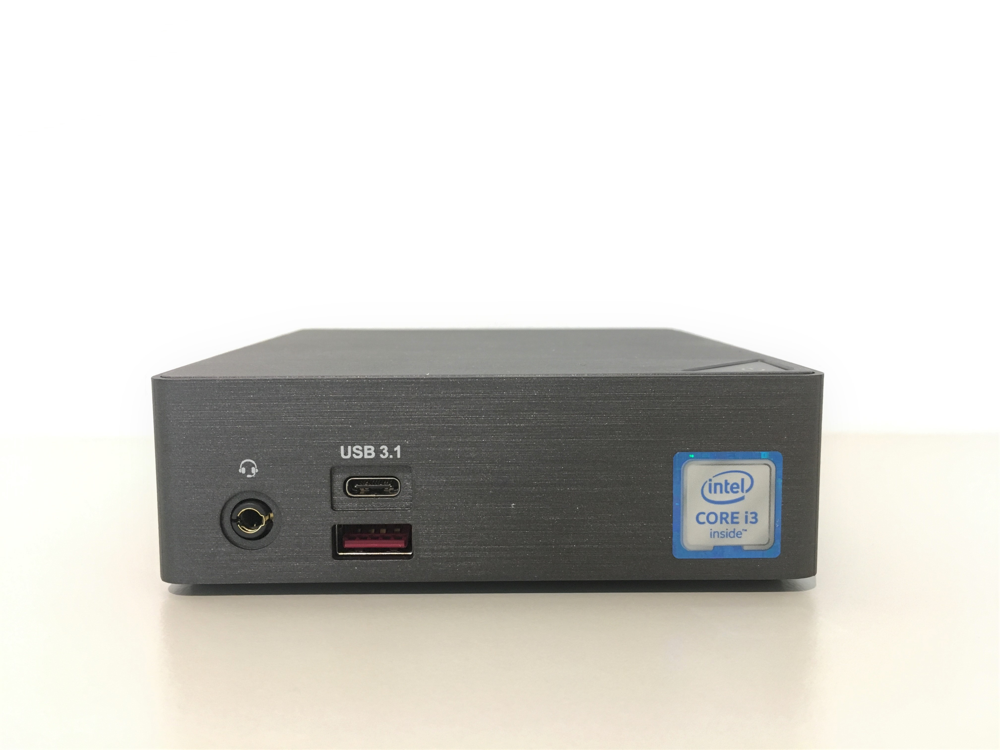
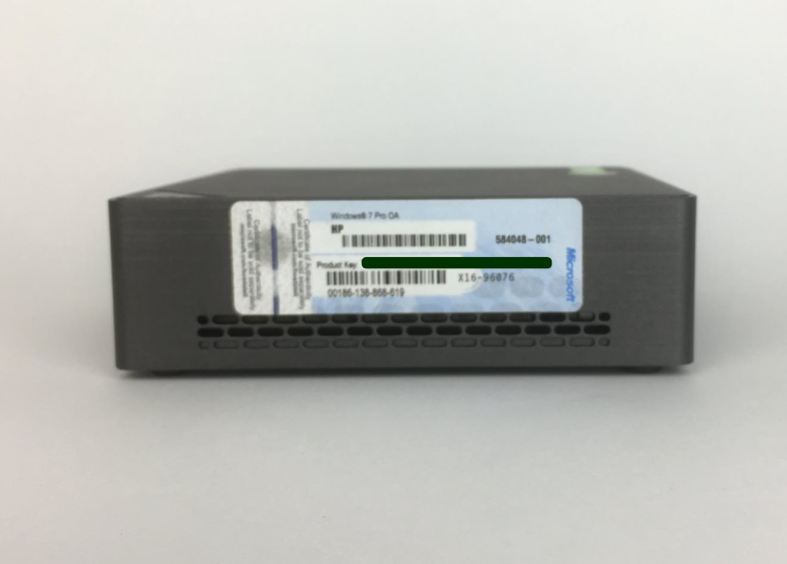
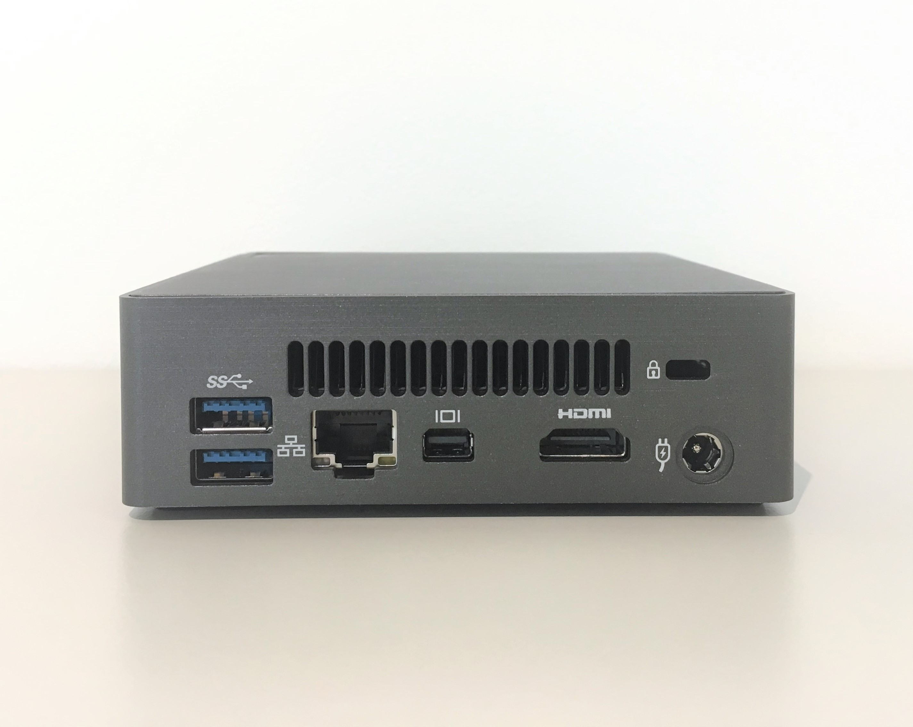

# Step DS563

## Spezifikation

Bereich               | Daten
--------------------- | -----
Abmessungen           | B x H x T: 112.6 x 34.4 x 119.4 mm
Motherboard Size      | 105 x 110 mm
Prozessor             | Intel® Core™ i3-6100U 2.3GHz
Hauptspeicher         | 4GB 2 x SO-DIMM DDR4 slots 2133MHz Max. 32GB
LAN                   | Gigabit LAN (Intel i219LM)
Festplatte            | 120 GB mSATA SSD
Audio                 | Realtek ALC255
Graphics              | Intel® HD Graphics 520
HDMI Auflösung  (Max.)| 4096 x 2160 @ 24Hz
Mini DP Auflösung (Max.)| 3840 x 2160 @ 60Hz
Erweiterungen       | 1 x M.2 slot (2280_storage) PCIe /SATA 1 x PCIe M.2 NGFF 2230 A-E key slot occupied by the WiFi+BT card
Vorderseite I/O             |  1 x USB 3.1 type C 1 x USB3.1 1 x head phone jack with MIC
Rückseite I/O              | 1 x HDMI(1.4a) 1 x Mini DisplayPort (1.2) 2 x USB 3.0 1 x RJ45 1 x DC-In 1 x Kensington lock slot
Power Supply          | Input: AC 100-240V Output: DC 19V 3.42A
VESA                  | Bracket included Supports 75 x 75 and 100 x 100 mm
WLAN-Karte            | Intel® Dual Band Wireless-AC 3165
USB3.1                | Asmedia
Unterstützte Betriebssysteme  | WIN7 32/64bit WIN8.1 64bit WIN10 64bit
Umgebung           | Betriebstemperatur: 0°C to +35°C System Lagertemperatur: -20°C to +60°C

## Weitere Bilder {#Step-DS563-Fotos}

