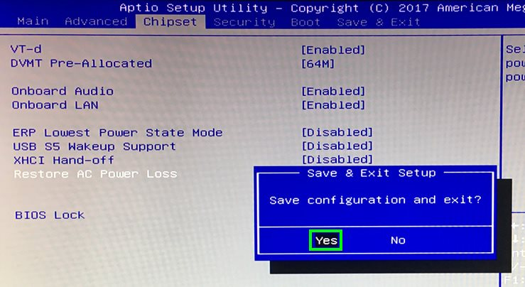

> #### info::Modell
> Step DS563 (120GB HD)

# BIOS-Version kontrollieren

Um sicherzustellen, dass alle Funktionen des Rechners einschließlich des zeitgesteuerten Aus/Einschalten korrekt funktionieren, benötigen Sie mindestens die BIOS-Version F5. 

* Beim Rechner-Start drücken Sie die Taste `Entf` und prüfen Sie die BIOS-Version. Wird eine ältere Version als **F5** verwendet, bitte [updaten](#Step-DS563-BIOS-updaten) Sie die Version auf F5. Ansonsten müssen Sie das BIOS nur noch [einstellen](#BIOS-Einstellen).

# BIOS-Version auf F5 updaten {#Step-DS563-BIOS-updaten}

* Starten Sie den Rechner. Ist Windows vollständig geladen, laden Sie das BIOS-Flash-Tool [Step-DS563_F5_BIOS.zip](ftp://ftp.stueber.de/pub/bin/de/windowsembedded/Step-DS563_F5_BIOS.zip) auf dem Desktop herunter und extrahieren Sie sie.

* Führen Sie das Flash-Tool aus. 

* Klicken Sie auf die Schaltfläche `Open`, wählen Sie `BIN Files` als Dateityp aus, anschließend suchen Sie die Datei **image.bin** aus.

* Wählen Sie die unten gezeigten Optionen aus, anschließend klicken Sie `Flash` um das BIOS-Update zu starten.
 

* Das BIOS wird geupdatet. Nach wenigen Minuten wird der Rechner neugestartet. Sie können dann das BIOS [einstellen](#BIOS-Einstellen).
 

# BIOS einstellen {#BIOS-Einstellen}

* Beim Rechner-Start drücken Sie die Taste `[Entf]`.

* Drucken Sie die Taste `[F3]`, anschließend wählen Sie `[Yes]`, um Standardeinstellungen des BIOS zu laden.

* Mit den Pfeiltasten wählen Sie die Registerkarte `Chipset`. Unter "Restore AC Power Loss" wählen Sie `Power On` aus.

* Wählen Sie nun die Registerkarte `Advanced`. Unter "OS Selection" wählen Sie `Windows 8.x/10` aus.

* Jetzt drücken Sie `[F4]` und wählen Sie `[Yes]`, um die Änderungen abzuspeichern und den Rechner neu zu starten.**

# Zusätzliche Funktionen

## Wake-On-LAN (WOL)

Wenn Wake-On-LAN (WOL) gewünscht ist, müssen Sie nichts weiteres Vornehmen. Dieser Rechner reagiert auf Wake-On-LAN-Anfragen, obwohl eine bestimme Einstellung dazu im BIOS nicht befindet.

## S5 RTC Wake

Unter dieser Option kann man eine Uhrzeit einstellen, zu der das System täglich hochgefahren wird.

Diese Option befindet sich unter der Registerkarte `[Advanced]` und `[S5 RTC Wake Settings]`.