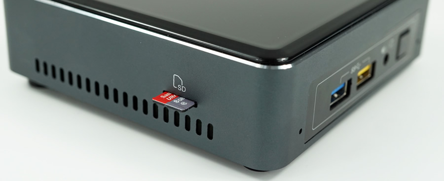

# Step DS573

## Spezifikation

Bereich               | Daten
--------------------- | -----
Abmessungen           | 107.6 x 114.4 x 33.9 mm (BxTxH)
Prozessor             | Intel® Core™ i3-7100U 2.3GHz (3M Cache, 2.40 Ghz)
Hauptspeicher         | 4GB DDR4 SO-DIMM (2 slots, 1 slot frei, max. 32GB)
LAN                   | Intel Gigabit Ethernet
Festplatte            | 120 GB M.2 2280
Audio                 | 7.1 digital (HDMI mDP); L+R+mic (F)
Graphics              | Intel® HD Graphics 620
HDMI Auflösung  (Max.)| Der HDMI 2.0 Port wird über einen Converter-Chip (DisplayPort 1.2 zu HDMI 2.0 4096 x 2160 @ 60Hz
Schnittstellen vorne  | 2 x USB 3.0 Type A (1x schnell-ladend) Ein-/Ausschalter
Schnittstellen linke  | 1 x SDHD/SDXC Cardreader mit UHS-1 Support
Schnittstellen hinten | 1 x HDMI 2.0 1 x USB Type-C mit USB 3.1 und DisplayPort 1.2 Unterstützung 2 x USB 3.0 1 x RJ-45 DC-in Netzteilanschluss
Netzteil          | Input: AC 100-240V Output: DC 19V 2.1A
VESA                  | Bracket included Supports 75 x 75 and 100 x 100 mm
WLAN-Karte            | Intel WLAN IEEE 802.11ac, Bluetooth 4.2
Unterstützte Betriebssysteme  | WIN10 64bit

## Weitere Bilder {#Step-DS573-Fotos}

