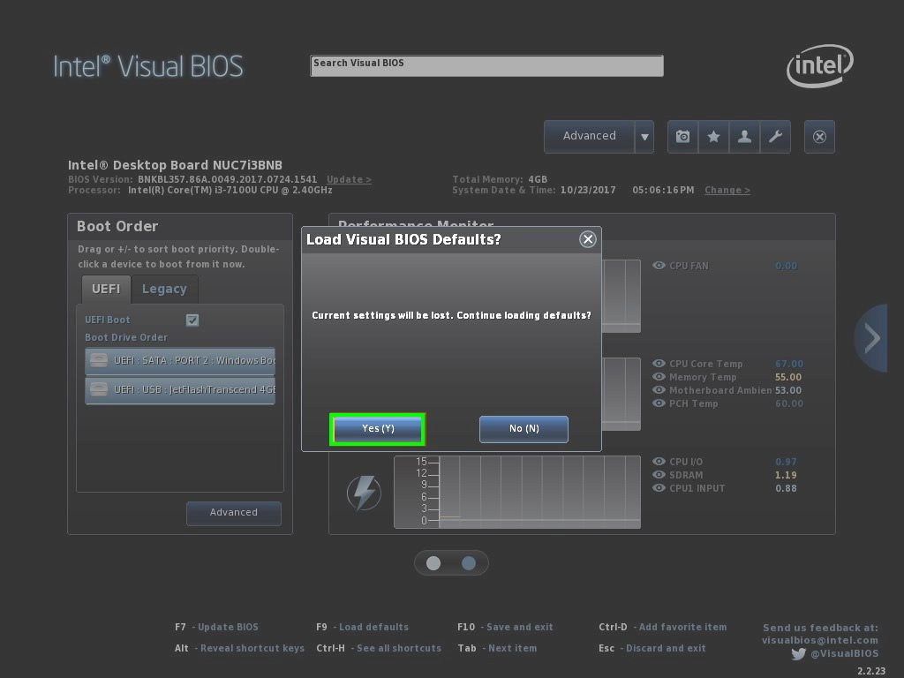
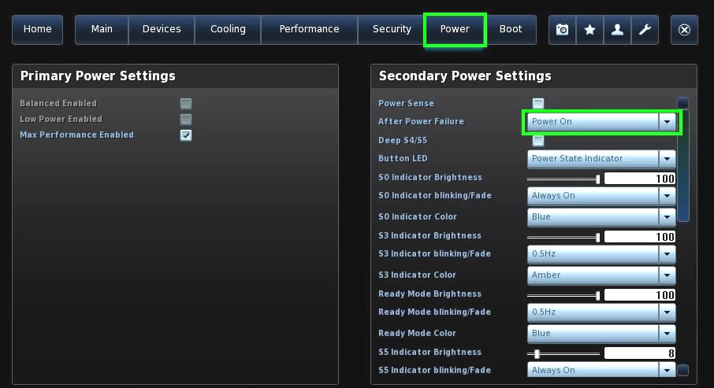
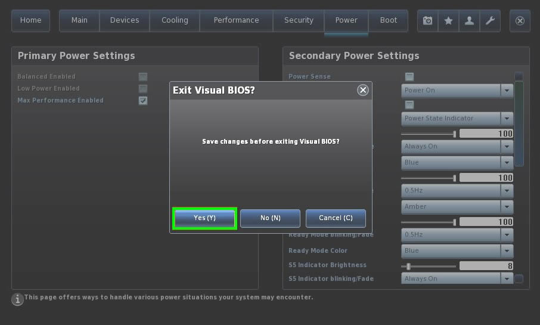
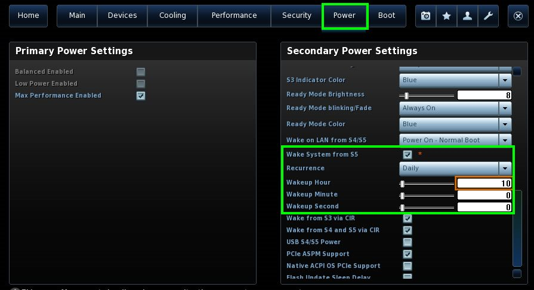

# Step DS573 | BIOS Konfigurieren

> #### info::Modell
> Step DS573 (120GB HD)

* Beim Rechner-Start drücken Sie die Taste `[F2]`.

* Drucken Sie die Taste `[F9]`, anschließend wählen Sie `[YES]`, um die Einstellungen erst neu zu setzen. 

* Wählen Sie die Schaltfläche `Advanced`.

* Wählen die Registerkarte **Power**, anschließend wählen Sie unter "After Power Failure" die Option `Power On` aus.

* Um die Änderungen abzuspeichern, drucken Sie die Taste `[F10]`. Drücken Sie die Taste `[Eingabe]`, um "Yes" zu bestätigen.

## Wake-On-LAN (WOL)

Wenn Wake-On-LAN (WOL) gewünscht ist, muss diese Funktion nur in [Windows](/tips/wake-on-lan/README.md) freigeschaltet werden. Dieser Rechner reagiert auf Wake-On-LAN-Anfragen, trotz fehlender Einstellung im BIOS.

## Wake system from RTC

Unter dieser Option kann man eine Uhrzeit einstellen, zu der das System täglich hochgefahren wird.

Diese Option befindet sich unter der Registerkarte `[Power]` und `[Wake system from S5]`.

